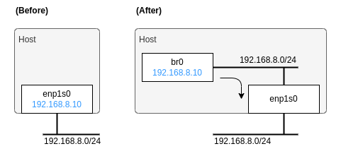

# How to create a Kubernetes cluster on KVM with Terraform + Kubespray

Here is a sample code of this article [Terraform + Kubespray で KVM 上に Kubernetes クラスタを構築 - Qiita](https://qiita.com/sawa2d2/items/c592dcbd958f69441068).

## Summary

Here explains how to build a Kubernetes cluster on KVM using Terraform + Kubespray according to the general steps:

1. Create VMs using Terraform.
1. From the generated `terraform.tfstate` in step 1., extract inventory information using a script (Dynamic Inventory).
1. Give the inventory information from step 2. and Kubespray's playbooks to Ansible to create a Kubernetes cluster.


The VM configuration in this repository is as shown in the diagram below:


## Prerequisite
- Terraform
- Container engine (docker, podman, nerdctl, etc.)
- KVM Packages
  - qemu-kvm
  - libvirt
- nmcli
- jq
- yq

## Setup

Clone this repo:
```
$ git clone https://github.com/sawa2d2/k8s-on-kvm.git
$ cd k8s-on-kvm/kubernetes
```

Create virtual bridge `br0` as follow steps:
```
# Settings
HOST_IP=192.168.8.10
CIDR=24
GATEWAY=192.168.8.1
DNS=192.168.8.1
NWIF=enp1s0
CON_NAME="Wired Network 1"

# Create br0
nmcli connection add type bridge ifname br0

# Set br0 same settings of enp1s0
nmcli connection modify bridge-br0 \
  ipv4.method manual \
  ipv4.addresses "$HOST_IP/$CIDR" \
  ipv4.gateway "$GATEWAY" \
  ipv4.dns $DNS

# Connect enp1s0 to br0
nmcli connection add type bridge-slave ifname $NWIF master bridge-br0
# Delete the existing network interface of enp1s0
nmcli connection delete $CON_NAME

# Enable br0
nmcli connection up bridge-br0
```

It illustrates a change from 'Before' to 'After' as demonstrated in the diagram below:


Check if the default pool of libvirt `/var/lib/libvirt/images/` exists:
```
$ virsh pool-list --all
 Name      State    Autostart
-------------------------------
 default   active   yes
```

If it does not exist, create it:
```
$ virsh pool-define /dev/stdin <<EOF
<pool type='dir'>
  <name>default</name>
  <target>
    <path>/var/lib/libvirt/images</path>
  </target>
</pool>
EOF

$ virsh pool-start default
$ virsh pool-autostart default
```

Download a qcow2 image of base OS (e.g. Rocky Linux 9) to the default pool:
```
$ sudo curl -L -o /var/lib/libvirt/images/Rocky-9-GenericCloud.latest.x86_64.qcow2 https://download.rockylinux.org/pub/rocky/9.2/images/x86_64/Rocky-9-GenericCloud.latest.x86_64.qcow2
```

Edit `cloud_init.cfg` to set your ssh public key:
```
#cloud-config
users:
  - name: root
    ssh-authorized-keys:
      - "<YOUR_SSH_KEY>"
...
```

## Provisioning VMs
Create `main.tf` as follow on your local:

```
module "kubernetes" {
  source = "github.com/sawa2d2/k8s-on-kvm//kubernetes/"

  # Localhost: "qemu:///system"
  # Remote   : "qemu+ssh://<user>@<host>/system"
  libvirt_uri = "qemu:///system"
  
  # Download the image by:
  #   sudo curl -L -o /var/lib/libvirt/images/Rocky-9-GenericCloud.latest.x86_64.qcow2 https://download.rockylinux.org/pub/rocky/9.2/images/x86_64/Rocky-9-GenericCloud.latest.x86_64.qcow2 
  vm_base_image_uri = "/var/lib/libvirt/images/Rocky-9-GenericCloud.latest.x86_64.qcow2"
  pool              = "default"
  
  bridge      = "br0"
  cidr        = "192.168.8.0/24"
  gateway     = "192.168.8.1"
  nameservers = ["192.168.8.1"]
  
  nodes = [
    {
      name           = "k8s-master-1"
      vcpu           = 4
      memory         = 16000                    # in MiB
      disk           = 100 * 1024 * 1024 * 1024 # 100 GB
      ip             = "192.168.8.101"
      mac            = "52:54:00:00:01:01"
      cloudinit_file = "cloud_init.cfg"
      description    = ""
      volumes        = []
  
      kube_control_plane = true
      kube_node          = true
      etcd               = true
    },
    {
      name           = "k8s-master-2"
      vcpu           = 4
      memory         = 16000                    # in MiB
      disk           = 100 * 1024 * 1024 * 1024 # 100 GB
      ip             = "192.168.8.102"
      mac            = "52:54:00:00:01:02"
      cloudinit_file = "cloud_init.cfg"
      description    = ""
      volumes        = []
  
      kube_control_plane = true
      kube_node          = true
      etcd               = true
    },
    {
      name           = "k8s-worker-1"
      vcpu           = 2
      memory         = 8000                     # in MiB
      disk           = 100 * 1024 * 1024 * 1024 # 100 GB
      ip             = "192.168.8.103"
      mac            = "52:54:00:00:01:03"
      cloudinit_file = "cloud_init.cfg"
      description    = ""
      volumes        = []
  
      kube_control_plane = false
      kube_node          = true
      etcd               = true
    },
    {
      name           = "k8s-worker-2"
      vcpu           = 2
      memory         = 8000                     # in MiB
      disk           = 100 * 1024 * 1024 * 1024 # 100 GB
      ip             = "192.168.8.104"
      mac            = "52:54:00:00:01:04"
      cloudinit_file = "cloud_init.cfg"
      description    = ""
      volumes        = []
  
      kube_control_plane = false
      kube_node          = true
      etcd               = false
    },
  ]
}

output "kubespray_hosts" {
    value = module.rook_ceph.kubespray_hosts
}
```

Then run the following to create VMs:

```
$ terraform init
$ terraform apply -auto-approve
```

### Create a Kubernetes cluster 
Run a kubespray container and execute Ansible playbook:
```
$ docker pull quay.io/kubespray/kubespray:v2.23.1
$ sudo docker run --rm -it \
  --mount type=bind,source="$(pwd)"/inventory,dst=/inventory \
  --mount type=bind,source="$(pwd)"/generate_inventory.py,dst=/kubespray/generate_inventory.py \
  --mount type=bind,source="$(pwd)"/terraform.tfstate,dst=/kubespray/terraform.tfstate \
  --mount type=bind,source="${HOME}"/.ssh/id_rsa,dst=/root/.ssh/id_rsa \
  quay.io/kubespray/kubespray:v2.23.1 bash

# Inside a container
$ ansible-playbook -i ./generate_inventory.py cluster.yml
```

FYI: The inventory information is extracted by `terraform output`:
```
.terraform/modules/kubernetes/kubernetes/generate_inventory.py
$ terraform output -json | jq '.kubespray_hosts.value'
```

### (Optional) Generate a static inventory file
```
$ cp -rf .terraform/modules/kubernetes/kubernetes/inventory/ .
$ .terraform/modules/kubernetes/kubernetes/generate_inventory.py | .terraform/modules/kubernetes/kubernetes/convert_inventory_to_yaml.sh > ./inventory/hosts.yaml
```

You also can create a kubernetes cluster by the `hosts.yaml`
```
$ sudo docker run --rm -it \
  --mount type=bind,source="$(pwd)"/inventory,dst=/inventory \
  --mount type=bind,source="${HOME}"/.ssh/id_rsa,dst=/root/.ssh/id_rsa \
  quay.io/kubespray/kubespray:v2.23.1 bash

# Inside a container
$ ansible-playbook -i /inventory/hosts.yaml cluster.yml
```

