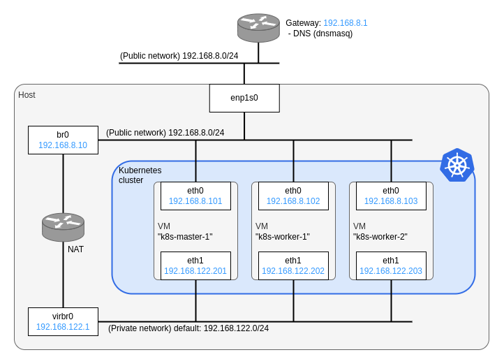

# How to create kubernetes cluster on KVM with terraform + kubespray

Here is a sample code of this article [Terraform + kubespray で KVM 上に Kubernetes クラスタを構築 - Qiita](https://qiita.com/sawa2d2/items/c592dcbd958f69441068).

## Network architecture

Here I will explain how to build a Kubernetes cluster on KVM using Terraform + Kubespray according to the general steps:

1. Create VMs using Terraform.
1. From the generated `terraform.tfstate` in step 1., extract inventory information using a script (Dynamic Inventory).
1. Give the inventory information from step 2. and Kubespray's playbooks to Ansible to create a Kubernetes cluster.


The VM configuration in this repository is as shown in the diagram below:



## Prerequisite
- Terraform
- podman
- KVM Packages
  - qemu-kvm
  - libvirt-clients
  - libvirt-daemon
  - bridge-utils
  - virt-manager

## Setup

Clone this repo:
```
$ git clone https://github.com/sawa2d2/k8s-on-kvm.git
$ cd k8s-on-kvm/kubernetes
```

Create virtual bridge `br0`:
```
$ ./create_br0.sh
```

Download a qcow2 image file of Rocky Linux 8.8 to the default pool of livbirt `/var/lib/libvirt/images/`:

```
$ sudo curl -L -o /var/lib/libvirt/images/Rocky-9-GenericCloud.latest.x86_64.qcow2 https://download.rockylinux.org/pub/rocky/8.8/images/x86_64/Rocky-8-GenericCloud.latest.x86_64.qcow2
```

Edit `cloud_init.cfg` to set your ssh public key:
```
#cloud-config
users:
  - name: root
    ssh-authorized-keys:
      - "<YOUR_SSH_KEY>"
...
```

## Provisioning VMs
```
$ terraform destroy -auto-approve -var-file="variables.tfvars"
$ ./provision.sh
```

## Creating a k8s Cluster

Pull the container image in advance:
```
$ podman pull quay.io/kubespray/kubespray:v2.22.1
```

### Using dynamic inventory
```
$ podman run --rm -it \
  --mount type=bind,source="$(pwd)"/inventory,dst=/inventory \
  --mount type=bind,source="$(pwd)"/generate_inventory.py,dst=/kubespray/generate_inventory.py \
  --mount type=bind,source="$(pwd)"/terraform.tfstate,dst=/kubespray/terraform.tfstate \
  --mount type=bind,source="${HOME}"/.ssh/id_ed25519,dst=/root/.ssh/id_ed25519 \
  quay.io/kubespray/kubespray:v2.22.1 bash
```

Inside the container run:
```
$ ansible-playbook -i ./generate_inventory.py cluster.yml
```

### Using static inventory
```
$ podman run --rm -it \
  --mount type=bind,source="$(pwd)"/inventory,dst=/inventory \
  --mount type=bind,source="${HOME}"/.ssh/id_ed25519,dst=/root/.ssh/id_ed25519 \
  quay.io/kubespray/kubespray:v2.22.1 bash
```
```
$ ./generate_hosts_yaml.py > ./inventory/hosts.yaml
$ ansible-playbook -i /inventory/hosts.yaml cluster.yml
```
