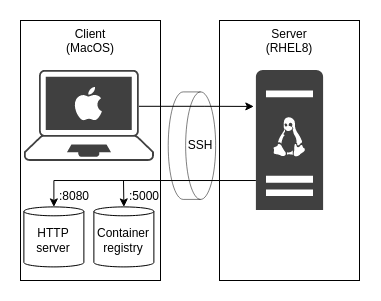

# How to apply Kubespray to a remote node that has restricted network

Here is a sample code of this article [Kubespray でオフライン・プロキシ環境下に Kubernetes を構築 - Qiita](https://qiita.com/sawa2d2/items/85b01696a229c23a7f61).



Run a HTTP server that has required files contains:
```
# On client
$ ./start-http-server-and-registry.sh
...

$ sudo podman ps
CONTAINER ID  IMAGE                           COMMAND               CREATED        STATUS            PORTS                 NAMES
e2a436ed5d9e  docker.io/library/nginx:alpine  nginx -g daemon o...  5 minutes ago  Up 5 minutes ago  0.0.0.0:8080->80/tcp  nginx
```

Forward the local port 8080 to remote port 8080:
```
# On client
$ ssh -R 8080:localhost:8080 -R 5000:localhost:5000 user@remote_host

# On remote
$ curl localhost:8080
```
