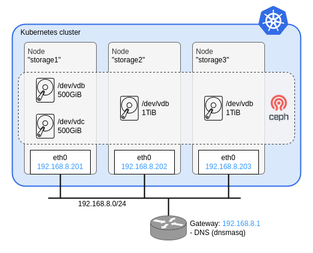

# Rook-Ceph

Here is a sample code of this article {TBD}.

## Summary

## Prerequisites
- Terraform
  - module: sawa2d2/terraform-modules/libvirt-cloudinit-bridge
- Container engine (docker, podman, nerdctl, etc.)
- KVM Packages
  - qemu-kvm
  - libvirt
- nmcli

