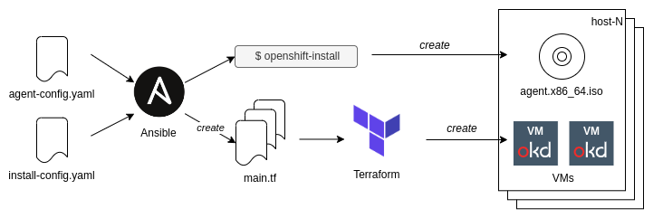

# How to create an OKD4 cluster on KVM with Terraform

This repository contains the sample code described in this article: [OpenShift (OKD4) on KVM - Qiita](https://qiita.com/sawa2d2/items/3cf9c9d5d9ce5f589124).

## Summary

This docs explains how to deploy an OKD4 cluster on KVM using Terraform according to the steps:

1. Create `install-config.yaml
1. Generate an iso image
1. Create KVMs by terraform with the image

The figure below represent the installation flow:




## Prerequisites
- `terraform`
- KVM Packages
  - `qemu-kvm`
  - `libvirt`
- `systemd-resolved`
- [`openshift-install`](https://github.com/okd-project/okd/releases)
- [`oc`](https://github.com/okd-project/okd/releases)


## Create an iso image
(Optional) Clear existing ignition files:
```
rm -r .openshift_install.log .openshift_install_state.json
```

Edit `install-config.yaml` to set `pullSecret` that is download from [Install OpenShift 4 | Pull Secret](https://console.redhat.com/openshift/install/pull-secret).

Create an iso image:
```
cp install-config.backup.yaml install-config.yaml
cp agent-config.backup.yaml agent-config.yaml
```

```
openshift-install agent create image
cp ./agent.x86_64.iso /home/images
```

## Provision resources
Copy a sample in [sample/](./sample) to your workespace and run the following:

```
terraform init
terraform apply -auto-approve
```

## Start HAProxy
Copy `haproxy.cfg` to the hosts's `/etc/haproxy/haproxy.cfg` and start HAProxy service:
```
systemctl enable haproxy
systemctl start haproxy
```

Then http://localhost:1936/ shows all the machine status (login by `admin:test`).

## Enable to access to the cluster from external clients
Add a records to your DNS on your home network to enable to access from external clients to a cluster.
This is an example record that a host has IP `192.168.8.10`:
```
address=/ocp4.example.com/192.168.8.10
```

## Wait until an OKD cluster is installed
Start monitoring installtion progress:
```
openshift-install  agent wait-for install-complete --log-level=debug
```


## Approve CSR of workers

Approve all pending CSRs:
```
oc get csr -o go-template='{{range .items}}{{if not .status}}{{.metadata.name}}{{"\n"}}{{end}}{{end}}' | xargs --no-run-if-empty oc adm certificate approve
```
