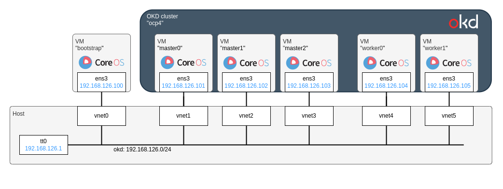

# How to create an OKD4 cluster on KVM with Terraform

Here is a sample code of this article [シングルノード OpenShift (OKD4) on KVM の構築 - Qiita](https://qiita.com/sawa2d2/items/3cf9c9d5d9ce5f589124).

## Summary

This docs will explain how to deploy an OKD4 cluster on KVM using Terraform according to the steps:

1. Create `install-config.yaml`for OKD4 settings
1. Generate ignition files by `openshift-install` command
1. Create KVMs by terraform with the ignition files

The figure below represent the installation flow:


The network configuration in this repository is as shown in the diagram below:



## Prerequisites
- `terraform`
- `podman`
- KVM Packages
  - `qemu-kvm`
  - `libvirt`


`openshift-install`:
```
$ curl -LO https://github.com/okd-project/okd/releases/download/3.14.0-0.okd-2023-10-28-073550/openshift-install-linux-4.14.0-0.okd-2023-10-28-073550.tar.gz
$ tar -zxvf openshift-install-linux-4.14.0-0.okd-2023-10-28-073550.tar.gz
$ mv openshift-install /usr/local/bin
$ openshift-install version
openshift-install 4.14.0-0.okd-2023-10-28-073550
built from commit 03546e550ae68f6b36d78d78b539450e66b5f6c2
release image quay.io/openshift/okd@sha256:7a6200e347a1b857e47f2ab0735eb1303af7d796a847d79ef9706f217cd12f5c
release architecture amd64
```

## Hot to use this Terraform module
Create `main.tf` as below:
```
module "okd" {
  libvirt_uri                = "qemu:///system"
  domain                     = "ocp4.example.com"
  network_name               = "okd"
  bridge_name                = "tt0"
  cidr                       = "192.168.126.0/24"
  gateway                    = "192.168.126.1"
  nameservers                = ["192.168.126.1"]
  use_dns_instead_of_haproxy = true
  load_balancer_ip           = "192.168.126.5"
  
  # Download a CoreOS image from:
  #   $ wget $(openshift-install coreos print-stream-json | jq -r '.architectures.x86_64.artifacts.qemu.formats["qcow2.xz"].disk.location')
  #   $ xz -dv *.qcow2.xz
  vm_base_image_uri = "/var/lib/libvirt/images/fedora-coreos-38.20230609.3.0-qemu.x86_64.qcow2"
  
  bootstrap = {
    name          = "bootstrap"
    vcpu          = 4
    memory        = 16384                    # in MiB
    disk          = 100 * 1024 * 1024 * 1024 # 100 GB
    ip            = "192.168.126.100"
    mac           = "52:54:00:00:00:00"
    ignition_file = "bootstrap.ign"
    description   = ""
    volumes       = []
  }
  
  masters = [
    {
      name          = "master0"
      vcpu          = 4
      memory        = 16284                    # in MiB
      disk          = 100 * 1024 * 1024 * 1024 # 100 GB
      ip            = "192.168.126.101"
      mac           = "52:54:00:00:00:01"
      ignition_file = "master.ign"
      description   = ""
      volumes       = []
    },
    {
      name          = "master1"
      vcpu          = 4
      memory        = 16384                    # in MiB
      disk          = 100 * 1024 * 1024 * 1024 # 100 GB
      ip            = "192.168.126.102"
      mac           = "52:54:00:00:00:02"
      ignition_file = "master.ign"
      description   = ""
      volumes       = []
    },
    {
      name          = "master2"
      vcpu          = 4
      memory        = 16384                    # in MiB
      disk          = 100 * 1024 * 1024 * 1024 # 100 GB
      ip            = "192.168.126.103"
      mac           = "52:54:00:00:00:03"
      ignition_file = "master.ign"
      description   = ""
      volumes       = []
    },
  ]
  
  workers = [
    {
      name          = "worker0"
      vcpu          = 2
      memory        = 8192                     # in MiB
      disk          = 100 * 1024 * 1024 * 1024 # 100 GB
      ip            = "192.168.126.104"
      mac           = "52:54:00:00:00:04"
      ignition_file = "worker.ign"
      description   = ""
      volumes       = []
    },
    {
      name          = "worker1"
      vcpu          = 2
      memory        = 8192                     # in MiB
      disk          = 100 * 1024 * 1024 * 1024 # 100 GB
      ip            = "192.168.126.105"
      mac           = "52:54:00:00:00:05"
      ignition_file = "worker.ign"
      description   = ""
      volumes       = []
    },
  ]
}
```

## Create network
Run:
```
terraform init
terraform apply -auto-approve -target=module.network
```

Enable to use libvirt's DNS from the host:
```
sudo resolvectl dns tt0 192.168.126.1
sudo resolvectl domain tt0 ~ocp4.example.com
```

FYI: Check if the network is created:
```
# Bridge:
$ bridge show
bridge name     bridge id               STP enabled     interfaces
tt0             8000.52540076c4ca       yes

# Network
$ virsh net-list
 Name      State    Autostart   Persistent
--------------------------------------------
 okd       active   yes         yes

# DNS, dnsmasq:
$ sudo cat /etc/libvirt/qemu/networks/okd.xml
<!--
WARNING: THIS IS AN AUTO-GENERATED FILE. CHANGES TO IT ARE LIKELY TO BE
OVERWRITTEN AND LOST. Changes to this xml configuration should be made using:
  virsh net-edit okd
or other application using the libvirt API.
-->

<network xmlns:dnsmasq='http://libvirt.org/schemas/network/dnsmasq/1.0'>
  <name>okd</name>
  <uuid>c442bfab-8bd2-4c64-84c1-318bb9e9e423</uuid>
  <forward mode='nat'/>
  <bridge name='tt0' stp='on' delay='0'/>
  <mac address='52:54:00:76:c4:ca'/>
  <domain name='ocp4.example.com' localOnly='yes'/>
  <dns>
    <host ip='192.168.126.5'>
      <hostname>api-int.ocp4.example.com</hostname>
      <hostname>api.ocp4.example.com</hostname>
    </host>
  </dns>
  <ip family='ipv4' address='192.168.126.1' prefix='24'>
    <dhcp>
      <range start='192.168.126.2' end='192.168.126.254'/>
    </dhcp>
  </ip>
  <dnsmasq:options>
    <dnsmasq:option value='address=/api.ocp4.example.com/192.168.126.5'/>
    <dnsmasq:option value='address=/api-int.ocp4.example.com/192.168.126.5'/>
    <dnsmasq:option value='address=/*.apps.ocp4.example.com/192.168.126.5'/>
    <dnsmasq:option value='address=/master0.ocp4.example.com/192.168.126.101'/>
    <dnsmasq:option value='address=/master1.ocp4.example.com/192.168.126.102'/>
    <dnsmasq:option value='address=/master2.ocp4.example.com/192.168.126.103'/>
    <dnsmasq:option value='address=/master0.ocp4.example.com/192.168.126.104'/>
    <dnsmasq:option value='address=/worker1.ocp4.example.com/192.168.126.105'/>
  </dnsmasq:options>
</network>
```

## Run HAProxy container
In advance, create the folowing network config file `tt0.conflist` in `/etc/cni/net.d`:

```
{
  "cniVersion": "0.4.0",
  "name": "tt0",
  "plugins": [
    {
      "type": "bridge",
      "bridge": "tt0",
      "isGateway": true,
      "ipMasq": true,
      "ipam": {
        "type": "static",
        "addresses": [
          {
            "address": "192.168.126.5/24",
            "gateway": "192.168.126.1"
          }
        ]
      }
    },
    {
      "type": "portmap",
      "capabilities": {
        "portMappings": true
      }
    }
  ]
}
```

Build and run a HAProxy container:

```
sudo podman build -t okd-haproxy -f ./haproxy.Dockerfile
sudo podman run -it --rm --network=tt0 -p 8080:9000 -v `pwd`/haproxy.cfg:/etc/haproxy/haproxy.cfg:ro okd-haproxy /bin/bash
```

Inside a container:
```
/start-haproxy
```

You can see status of HAProxy via http://localhost:8080/ and login by `admin:test`.

## Preparing ignition files
Create `install-config.yaml` as below:

```
apiVersion: v1
baseDomain: example.com
compute:
- hyperthreading: Enabled
  name: worker
  replicas: 0
controlPlane:
  hyperthreading: Enabled
  name: master
  replicas: 3
metadata:
  name: ocp4
networking:
  clusterNetwork:
  - cidr: 192.168.126.0/24
    hostPrefix: 64
  serviceNetwork:
  - 172.30.0.0/16
  machineNetwork:
  - cidr: 192.168.126.0/24
  networkType: OVNKubernetes
platform:
  none: {}
pullSecret: ''
sshKey: '<SSH_KEY>'
```

Make a backup:
```
cp install-config.yaml install-config.yaml.backup
```

Generate ignition files:
```
cp install-config.yaml.backup install-config.yaml
openshift-install create ignition-configs
```

## Create a bootstrap node
Create a bootstrap node first:
```
terraform apply -auto-approve -target=module.bootstrap
```

## Create a master/worker nodes
Create master and worker nodes:
```
terraform apply -auto-approve -target=module.cluster
```

Now six VMs and one container are run on the bridge `tt0`:
```
$ brctl show
bridge name     bridge id               STP enabled     interfaces
tt0             8000.525400b3d152       yes             veth26fc05a2
                                                        vnet0
                                                        vnet1
                                                        vnet2
                                                        vnet3
                                                        vnet4
                                                        vnet5
```

## Waiting for an OKD cluster is build
See the progress of installation:
```
openshift-install wait-for bootstrap-complete --log-level=info
```

For more details, execute the following in the bootstrap node:
```
journalctl -u bootkube | grep bootkube.sh | tail -n 20
```

## Destroy the bootstrap node when bootstrapping complete
Destroy the bootstrap node:
```
terraform destroy -auto-approve -target=module.bootstrap
```

Update DNS of the network:
```
terraform apply -auto-approve -target=module.network -var="exclude_bootstrap=true"
```

## Cleanup

Destroy all the nodes and network:
```
terraform destroy -auto-approve
```

Delete files generated by `openshift-instasll`:
```
rm -rf  bootstrap.ign bootstrap_injection.ign master.ign worker.ign .openshift_install.log .openshift_install_state.json auth/
```
