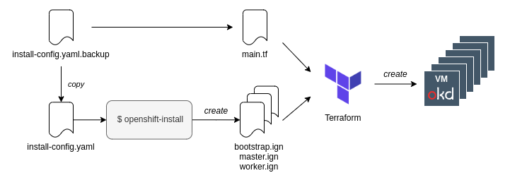

# How to create an OKD4 cluster on KVM with Terraform

This repository contains the sample code described in this article: [OpenShift (OKD4) on KVM - Qiita](https://qiita.com/sawa2d2/items/3cf9c9d5d9ce5f589124).

## Summary

This docs explains how to deploy an OKD4 cluster on KVM using Terraform according to the steps:

1. Create `install-config.yaml`for OKD4 settings
1. Generate ignition files by `openshift-install` command
1. Create KVMs by terraform with the ignition files

The figure below represent the installation flow:



The network configuration in this repository is as shown in the diagram below:


## Prerequisites
- `terraform`
- KVM Packages
  - `qemu-kvm`
  - `libvirt`
- `systemd-resolved`
- [`openshift-install`](https://github.com/okd-project/okd/releases)
- [`oc`](https://github.com/okd-project/okd/releases)


## Prepare network config
Add the following settings to `/etc/systemd/resolved.conf`:
```
[Resolve]
DNS=192.168.126.1
Domains=~ocp4.example.com
```

Apply the setting:
``` 
sudo systemctl restart systemd-resolved
``` 

## Create ignition files

(Optional) Clear existing ignition files:
```
rm -rf bootstrap.ign master.ign worker.ign .openshift_install.log .openshift_install_state.json auth/
```

Generate ignition files:
```
cp install-config.yaml.backup install-config.yaml && openshift-install create ignition-configs
```


## Provision resources
Copy [sample/main.tf](./sample/main.tf) to your project root and run the following commands:

```
terraform init
terraform apply -auto-approve
```

Check if DNS records are as follow:
```
$ less /etc/libvirt/qemu/networks/okd.xml
...
  <dnsmasq:options>
    <dnsmasq:option value='address=/api.ocp4.example.com/192.168.126.1'/>
    <dnsmasq:option value='address=/api-int.ocp4.example.com/192.168.126.1'/>
    <dnsmasq:option value='address=/apps.ocp4.example.com/192.168.126.1'/>
    <dnsmasq:option value='address=/bootstrap.ocp4.example.com/192.168.126.100'/>
    <dnsmasq:option value='address=/master0.ocp4.example.com/192.168.126.101'/>
    <dnsmasq:option value='address=/master1.ocp4.example.com/192.168.126.102'/>
    <dnsmasq:option value='address=/master2.ocp4.example.com/192.168.126.103'/>
    <dnsmasq:option value='address=/worker0.ocp4.example.com/192.168.126.104'/>
    <dnsmasq:option value='address=/worker1.ocp4.example.com/192.168.126.105'/>
  </dnsmasq:options>
```

## Start HAProxy
Copy [`haproxy.cfg`](./haproxy.cfg) to `/etc/haproxy/haproxy.cfg` and start HAProxy service:
```
systemctl start haproxy
```

Then http://localhost:9000/ shows all the machine status (login by `admin:test`).

## Enable to access to the cluster from external clients
Add a records to your DNS on your home network to enable to access from external clients to a cluster.
This is an example record that a host has IP `192.168.8.10`:
```
address=/ocp4.example.com/192.168.8.10
```


## Wait until an OKD cluster is installed
Start monitoring installtion progress:
```
openshift-install wait-for bootstrap-complete --log-level=info
```

For more details, execute the following in the bootstrap node:
```
journalctl -u bootkube | grep bootkube.sh | tail -n 20
```

## Remove the bootstrap node
Destroy the bootstrap node after bootstrapping complete:
```
terraform destroy -auto-approve -target=module.okd.module.bootstrap
```

Update DNS of the network:
```
terraform apply -auto-approve -target=module.okd.libvirt_network.network -var="exclude_bootstrap=true"
```

## Approve CSR of workers

Approve all pending CSRs:
```
oc get csr -o go-template='{{range .items}}{{if not .status}}{{.metadata.name}}{{"\n"}}{{end}}{{end}}' | xargs --no-run-if-empty oc adm certificate approve
```
