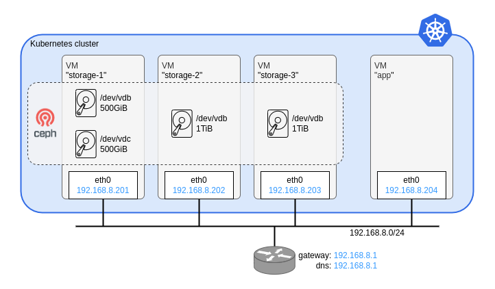

# Ceph Rook test

# Summary 

## Prerequisite
- Terraform
  - module: sawa2d2/terraform-modules/kvm-cloudinit
- Container engine (docker, podman, nerdctl, etc.)
- KVM Packages
  - qemu-kvm
  - libvirt
- nmcli

