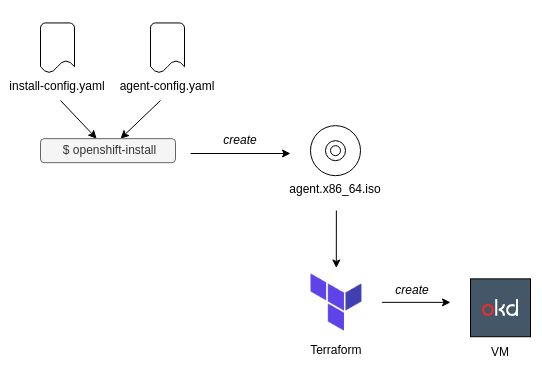

# How to create an OKD4 cluster on KVM with Terraform

Here is a sample code of this article [Terraform で KVM 上に Single Node OpenShift/OKD (SNO) を構築する - Qiita](https://qiita.com/sawa2d2/items/45eda993ccd1c54e6fcd)

## Summary
This docs explains how to deploy an OKD4 cluster on KVM using Terraform according to the steps:

1. Create `install-config.yaml
1. Generate an Agent ISO image file
1. Create KVMs by terraform with the image

The figure below represent the installation flow:



## Prerequisites
- container engine (`docker`, `podman`, `containerd`, etc.)
- `terraform`
- KVM Packages
  - `qemu-kvm`
  - `libvirt`
- [`oc`](https://github.com/okd-project/okd/releases)
- [`openshift-install`](https://github.com/okd-project/okd/releases)

## Building an Agent iso image
Edit `install-config.yaml` to set `pullSecret` downloadable from [Install OpenShift 4 | Pull Secret](https://console.redhat.com/openshift/install/pull-secret).

Create a builder container:
```
$ export OKD_VERSION=4.15.0-0.okd-2024-03-10-010116
$ docker image build ./ -t openshift-install --build-arg VERSION=${OKD_VERSION}
$ docker container run -it --rm openshift-install version
```

Build an Agent ISO and copy the image to the libvirt `default` pool:
```
rm -rf ocp
mkdir -p ocp image_cache files_cache
cp *.yaml ocp/
docker run --privileged --rm \
    -v $PWD:/data \
    -v ./image_cache:/root/.cache/agent/image_cache \
    -v ./files_cache:/root/.cache/agent/files_cache \
    -w /data openshift-install:latest \
    --dir ocp agent create image
sudo cp ./ocp/agent.x86_64.iso /var/lib/libvirt/images/
```

## Provisioning resources
Use the following commands:
```
terraform init
terraform apply -auto-approve
```

## Waiting for the installation to finish
Monitor the installtion progress:
```
export KUBECONFIG=`pwd`/ocp/auth/kubeconfig
openshift-install --dir ocp/ wait-for install-complete

## (Informative) Take an initial snapshot
```
virsh snapshot-create-as --domain master0 -- name init
```
